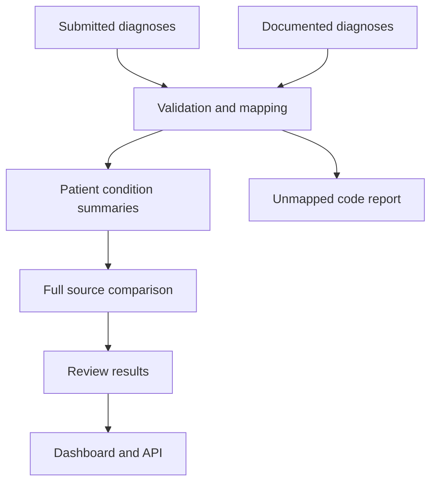

# Healthcare Coding Review

## Live application

I built an interactive dashboard to explore the coding review results, filter patient and condition records, examine unmapped diagnosis codes, and download the review queue.

[Open the live application](https://healthcare-coding-review.streamlit.app/)

I built this project to compare diagnosis groups found in submitted claims with diagnosis groups found in clinical documentation. I wanted the result to be useful for review while keeping every decision traceable to the records that produced it.

I used synthetic data throughout the project. The application does not determine whether a diagnosis is correct and does not change a claim. It identifies differences that a person can investigate.

## What I built

I created two working implementations of the same comparison logic.

The Snowflake implementation models the warehouse workflow with relational tables, reusable mappings, transformation queries, analytical views, audit records, and data quality checks.

The Python implementation runs the full workflow locally. It reads source files, validates their structure and relationships, applies the review period, reconciles diagnosis groups, explains each result, and writes the final outputs safely.

I also built an interactive Streamlit dashboard and a read only FastAPI service so the results can be explored through both a visual application and an application interface.

## Results

My synthetic dataset produces 14 patient and condition group comparisons.

1. Nine groups appear in both sources and receive a Captured status
2. Three groups appear only in documentation and receive a Potential Gap Review Required status
3. Two groups appear only in submitted claims and receive a Submitted Code Documentation Review Required status
4. Five differences enter the human review queue
5. Two intentionally unmapped diagnosis codes remain visible for investigation

## How my pipeline works



I validate each input before running the comparison. I check required columns, unique identifiers, and relationships between patients, claims, and diagnosis records.

I filter both sources with the same review period and mapping version. I summarize each source to one record for each patient and condition group before comparing them. This prevents repeated claims or diagnoses from inflating the results.

I use a full source comparison so I retain matches and differences from either side. I assign a clear reason to every result and keep supporting diagnosis codes and dates available for review.

I write each output through an atomic file operation. This prevents a failed run from leaving behind a partially written result file.

## Project structure

`src/coding_review` contains the reusable Python package

`data/raw` contains the synthetic source records

`data/processed` contains reproducible pipeline outputs

`sql` contains the Snowflake data model and transformation workflow

`app/dashboard.py` contains the Streamlit review application

`app/api.py` contains the FastAPI service

`tests` contains unit, integration, edge case, and output tests

`docs` contains the data dictionary and technical walkthrough

`.github/workflows` contains the automated quality workflow

## Run the Python pipeline

I use Python 3.11 or newer.

```bash
python -m pip install -e ".[app,dev]"
coding-review
```

The command reads the files in `data/raw` and writes the results to `data/processed`.

I can choose a different review period or mapping version when needed.

```bash
coding-review \
  --start-date 2026-01-01 \
  --end-date 2026-06-30 \
  --mapping-version DEMO_V1
```

## Run the dashboard

```bash
streamlit run app/dashboard.py
```

The dashboard presents result totals, review status counts, record filtering, patient and condition search, downloadable results, and unmapped diagnosis monitoring.

## Run the application interface

```bash
uvicorn app.api:app --reload
```

I included a health check, a filtered review results endpoint, and a summary endpoint. FastAPI provides interactive documentation after the service starts.

## Run the tests

```bash
python -m pytest
```

My tests verify the expected status totals, unique output grain, unmapped code visibility, voided claim exclusion, review period filtering, duplicate evidence handling, configuration validation, input contracts, and output creation.

The automated GitHub workflow also checks the Python code, parses the Snowflake SQL, runs the pipeline, and measures test coverage whenever I push a change or open a pull request.

## Engineering decisions

I keep diagnosis mappings outside the comparison logic so I can update a mapping version without rewriting the pipeline.
I preserve unmapped codes instead of silently dropping them. This makes data quality problems visible.
I aggregate each source before comparing it. This protects the final patient and condition grain from many to many join inflation.
I separate domain logic from the dashboard and API. The same reconciliation code can support different interfaces without being duplicated.
I use only synthetic information. The repository contains no protected health information, account credentials, or proprietary coding mappings.

## Limitations

The project demonstrates a repeatable batch workflow with a small synthetic dataset

## Technologies

Python
Snowflake SQL
Streamlit
FastAPI
Pytest
Ruff
SQLFluff
GitHub Actions
Docker
