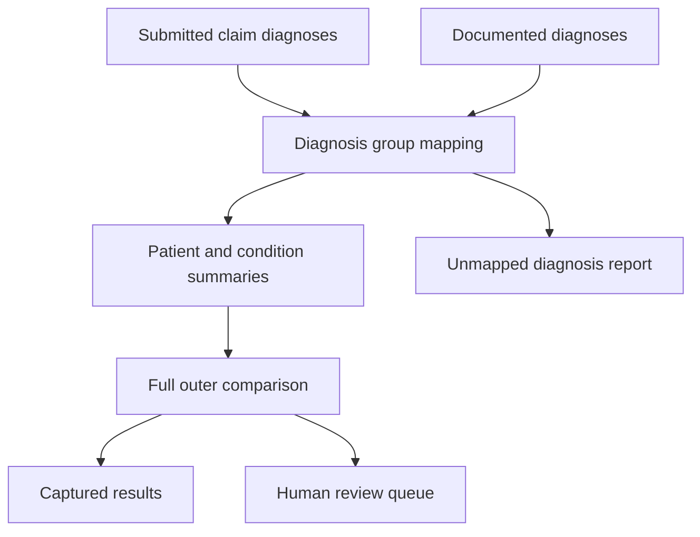

# Healthcare Coding Review

I built this Snowflake SQL project to compare diagnosis groups found in submitted claims with diagnosis groups found in clinical documentation.

I used synthetic healthcare data to identify matches and differences between the two sources. The final output separates captured diagnosis groups from records that require human review.

## Why I built this project

While working with patient intake and clinical documentation, I saw how diagnosis information can appear across different records.

I wanted to explore how SQL could compare submitted claim information with documented information while keeping every result traceable to its source.

I designed the project to identify records for review. It does not automatically add, remove, or change diagnosis codes.

## How the pipeline works

I built the pipeline to complete the following steps.

1. I load synthetic patient, claim, and diagnosis records.
2. I map diagnosis codes from both sources to the same condition groups.
3. I summarize the submitted groups for each patient.
4. I summarize the documented groups for each patient.
5. I compare both summaries with a full outer join.
6. I classify each patient and condition group combination.
7. I create a queue containing the differences that require human review.
8. I keep unmapped diagnosis codes visible in a separate report.

## Important design decision

A patient can have several claims, and each claim can contain several diagnosis codes. The documentation can also contain several diagnosis records for the same patient.

I first mapped and summarized each source separately. This gave me one row for each patient and condition group before I compared the two sources.

I then used a full outer join so I could retain all three possible outcomes.

1. The condition group appears in both sources.
2. The condition group appears only in the documentation.
3. The condition group appears only in the submitted claims.

An inner join would have retained only the matches and removed the differences that I wanted to review.

## Review statuses

| Status | Meaning |
|---|---|
| `Captured` | I found the condition group in both the submitted claims and the documentation |
| `Potential Gap - Review Required` | I found the condition group in the documentation but not in the submitted claims |
| `Submitted Code - Documentation Review Required` | I found the condition group in the submitted claims but not in the documentation |

These statuses identify records for review. They do not prove that a coding error occurred.

## Features

* I separated patient, claim, submitted diagnosis, documented diagnosis, mapping, result, and audit data
* I used a configurable review period
* I used a full outer join to preserve matches and both types of differences
* I retained submitted and documented diagnosis code lists for traceability
* I prevented repeated claims from creating duplicate patient and condition group results
* I excluded voided claims and records outside the review period
* I created a separate report for diagnosis codes missing from the mapping table
* I created readable review statuses and explanations
* I used only synthetic data with no protected health information or credentials

## Repository structure

| Path | What I included |
|---|---|
| `sql/01_setup.sql` | I create the source, mapping, result, configuration, and audit tables |
| `sql/02_seed_synthetic_data.sql` | I load synthetic matches, differences, excluded records, and unmapped codes |
| `sql/03_build_results.sql` | I map, summarize, compare, and classify the diagnosis groups |
| `sql/04_analysis_views.sql` | I create the human review queue, status summary, and unmapped code views |
| `sql/05_data_quality_tests.sql` | I check counts, uniqueness, filtering, status logic, and table relationships |
| `sample_output/` | I provide the expected results from the synthetic data |
| `tests/` | I provide automated tests for the expected output |
| `docs/` | I provide the data dictionary and technical documentation |

## How to run the project in Snowflake

1. I sign in to Snowflake and open a SQL worksheet.
2. I select a warehouse that I have permission to use.
3. I run `sql/01_setup.sql`.
4. I run `sql/02_seed_synthetic_data.sql`.
5. I run `sql/03_build_results.sql`.
6. I run `sql/04_analysis_views.sql`.
7. I run `sql/05_data_quality_tests.sql`.
8. I confirm that the validation checks return `PASS`.
9. I confirm that the exception queries return zero rows.
10. I compare the results with the files in `sample_output/`.

The setup script uses `CREATE OR REPLACE TABLE`. I only run it inside the designated practice database and schema.

## Expected results

My synthetic dataset produces 14 patient and condition group comparisons.

| Status | Comparisons |
|---|---:|
| Captured | 9 |
| Potential Gap - Review Required | 3 |
| Submitted Code - Documentation Review Required | 2 |

The five differences appear in the human review queue.

I also included two intentionally unmapped diagnosis codes. `Z00.00` appears on the submitted claims side, and `E78.5` appears on the documentation side. I keep both codes visible in the unmapped diagnosis report instead of allowing them to disappear from the analysis.

## Example patient result

Patient 003 has `I10` in both the submitted claims and the documentation. I map `I10` to `DEMO_CARDIOVASCULAR`, so that patient and condition group combination receives a `Captured` status.

The same patient also has documented `E11.9`, which I map to `DEMO_DIABETES`. Because that condition group does not appear in the submitted claims, it receives a `Potential Gap - Review Required` status.

The pipeline places that difference in the human review queue. It does not automatically add the diagnosis to a claim.

## Validation

I included SQL checks that confirm the following results.

* I produce 14 patient and condition group comparisons
* I produce 9 captured results
* I produce 3 potential gap results
* I produce 2 submitted code review results
* I produce 5 records in the human review queue
* I do not create duplicate patient and condition group results
* I exclude voided claims
* I exclude records outside the configured review period
* I keep unmapped diagnosis codes visible
* I assign each status according to the submitted and documented indicators

I also checked the SQL files with SQLFluff using the Snowflake dialect and tested the comparison logic against the included synthetic data.

## Technologies and skills

* Snowflake SQL
* Relational data modeling
* Common table expressions
* Full outer joins
* Conditional logic with `CASE` and `IFF`
* Diagnosis code mapping
* Aggregation with `LISTAGG`
* Data deduplication
* Source traceability
* Analytical views
* Data quality testing
* Technical documentation
